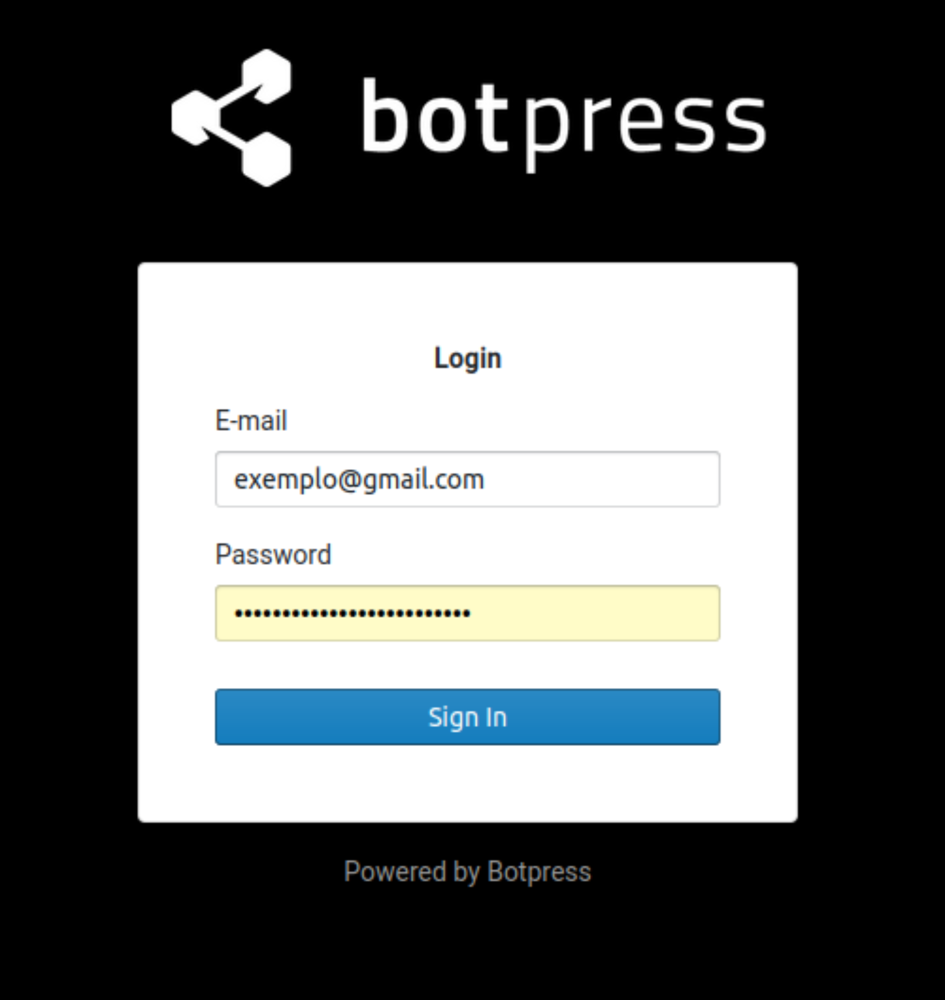
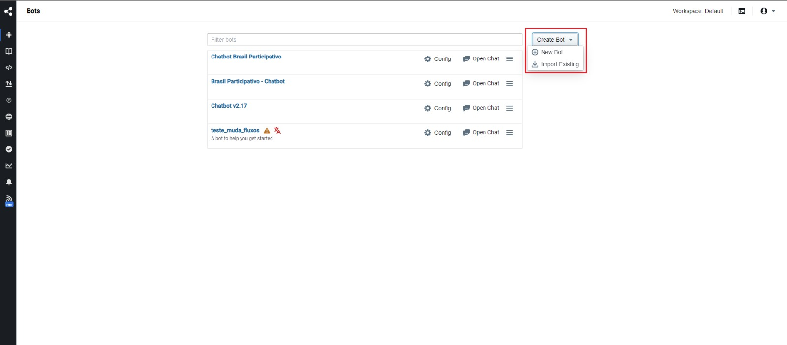
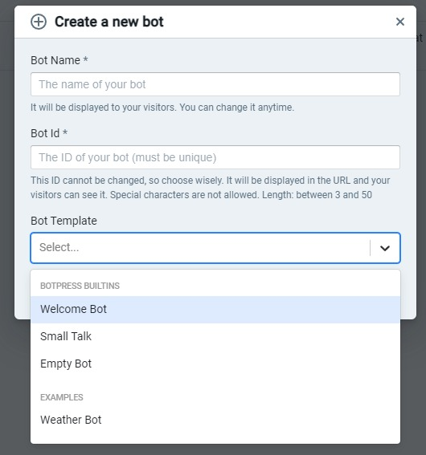
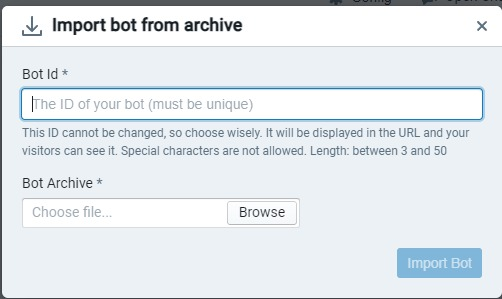
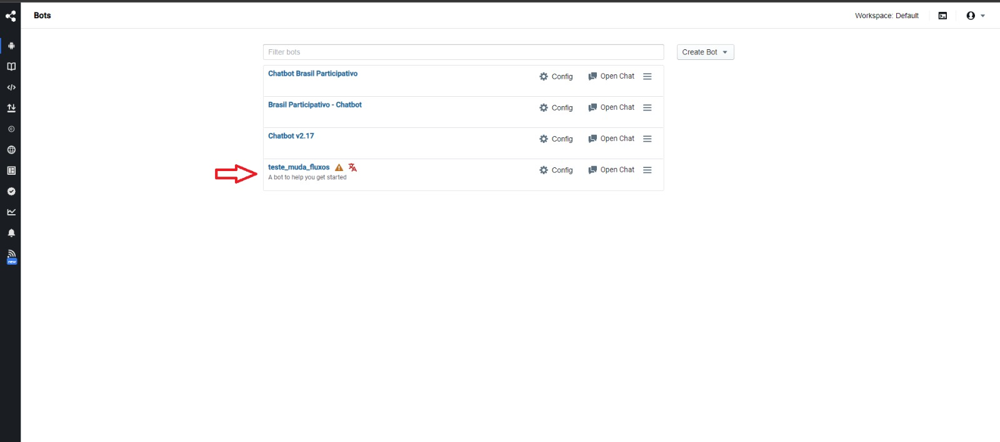

# Como criar um novo bot

## Logar no painel de admin do botpress

Para criação de um novo bot é nescessário fazer login com email e senha que foram utilizados para criação da conta no botpress, esta conta é a conta de administrador, necessária para a criação de um novo bot 

## Clicar no botão Create bot

No canto superior direito do painel inicial após o login existe um botão "Create Bot", ao colocar o cursor sobre este botão serão apresentadas duas opções para a criação de um novo bot

### "New bot"

Ao selecionar o botão para criar um novo bot, uma janela será exibida onde algumas opções devem ser preenchidas.

- Bot name: deve ser preenchido com o nome desejado para seu Bot

- Bot ID: neste campo deve ser informado o ID do bot, este ID deve ser exclusivo para o bot. (Este ID não pode ser mudado depois de selecionado)

- Bot template: Aqui pode ser selecionado algum dos templates de bot disponibilizados pelo botpress, também é possível criar um bot totalmente novo através da seleção da opção "empty bot"

### Import Bot

De forma semelhante ao selecionar o botão "new bot" uma janela será exibida para que sejam preenchidas algumas informações.

- Bot ID: neste campo deve ser informado o ID do bot, o ID deve ser exclusivo para o bot. (Este ID não pode ser mudado depois de selecionado)

- Arquivo do bot: Deve ser selecionado um arquivo para importar as configurações de um bot pré feito. (existe uma opção de exportar um bot feito e treinado)

## Visualizando seus bots

Todos os bots criados devem aparecer na área principal do painel de adiministrador, logo uma vez criado um novo bot ele deverá aparecer nesta área

